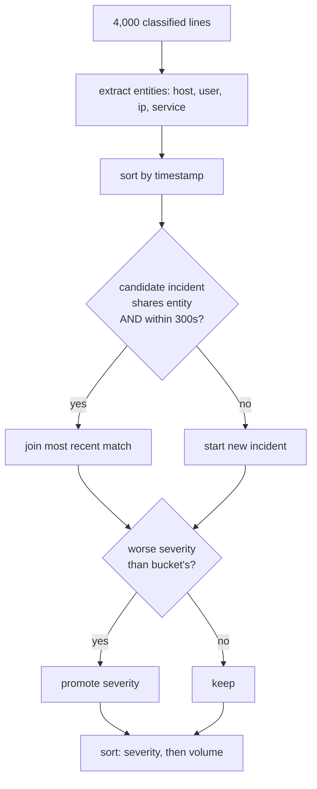

# Architecture

## The whole system in one picture

```
                          ┌─────────────────────────────────────┐
  log file / paste  ────► │  src/api.py  (FastAPI)              │
                          │  parses [timestamps], serves UI     │
                          └──────────────┬──────────────────────┘
                                         │ list of (text, timestamp)
                                         ▼
                          ┌─────────────────────────────────────┐
                          │  src/pipeline.py  classify_batch()  │
                          └──────────────┬──────────────────────┘
                                         │
        ┌────────────────────────────────┼────────────────────────────────┐
        ▼                                ▼                                ▼
┌───────────────┐              ┌────────────────┐              ┌─────────────────┐
│ regex_classifier│  no match  │ ml_classifier  │  <0.60 conf  │ llm_classifier  │
│ config.py rules│ ──────────► │ TF-IDF+LogReg  │ ───────────► │ Groq, classify  │
│ ~0.02ms, free │              │ ~1ms, free     │              │ ~200ms, ~$0.00003│
└───────┬───────┘              └────────┬───────┘              └────────┬────────┘
        │  category+matched             │ category+confidence          │ category+raw
        └───────────────────────────────┴──────────────────────────────┘
                                         │
                                         ▼
                          ┌─────────────────────────────────────┐
                          │  src/incidents.py                   │
                          │  entity extraction + time-window    │
                          │  grouping → ranked incidents        │
                          └──────────────┬──────────────────────┘
                                         │
                    ┌────────────────────┼────────────────────┐
                    ▼                    ▼                    ▼
             incidents[]          cost + latency         src/store.py
             (the deliverable)    percentiles            SQLite history
```

## Module map, and why each file exists

Line counts are `wc -l` on the current files. They are approximate and will drift
as the code changes — they are here to show proportion, not to be quoted as a
metric.

| File | Lines | Job | Would change when |
|---|---|---|---|
| `config.py` | ~214 | All tunables: categories, regex rules, thresholds, severity, entity patterns | You want different behaviour, not different logic |
| `regex_classifier.py` | ~51 | Tier 1. Match a line against the rules | Rules stop covering real phrasings |
| `ml_classifier.py` | ~291 | Tier 2. Train, evaluate, classify | The dataset grows past a few thousand rows |
| `llm_classifier.py` | ~205 | Tier 3. Prompt the model, resolve to a category | The model or provider changes |
| `pipeline.py` | ~356 | Routing, cost accounting, latency percentiles | The tier order changes |
| `incidents.py` | ~309 | Entity extraction, time-window grouping, severity | The grouping rule changes |
| `store.py` | ~174 | SQLite persistence for run history | You outgrow a single-file DB |
| `api.py` | ~290 | REST endpoints, log-line parsing, static serving | You add auth or a real frontend build |
| `static/` | ~716 | Hand-written HTML/CSS/JS, no framework | The UI grows past ~10 components |

**Total: ~1,890 lines of Python, ~716 of frontend.** That is deliberately small
enough to read end to end, which is the point — a fresher who cannot explain a
line cannot defend the project.

## The three decisions that shaped everything

### 1. Tiers are ordered by cost, and abstention is a first-class outcome

Each tier may return "I don't know". That is not a failure — it is the mechanism
the whole design runs on.

```python
# src/pipeline.py
category = classify_regex(text)          # may be None
if category: return ...

category, confidence = classify_ml(text) # may be (None, 0.3)
if category: return ...

category = classify_llm(text)            # always answers
```

The critical property: **a tier that abstains never guesses.** `classify_with_ml`
returns `(None, confidence)` — it withholds the label while still reporting how
confident it was, which is what makes the 0.491 honest accuracy usable rather
than merely discouraging.

**Why this matters:** a system where each tier guesses is a system where you
cannot tell which answers were earned. The cost panel showing "10 regex, 0 ML,
4 LLM" is only meaningful because ML abstaining is visible rather than hidden.

### 2. Incidents are groups, not lines

The single biggest design decision, and the one that turns a classifier into a
tool. Four thousand classified lines are still four thousand lines. Seven ranked
incidents are something a person acts on.

The grouping rule is two conditions, and **both are necessary**:

```python
same incident  ⇔  shares ≥1 entity  AND  within INCIDENT_WINDOW_SECONDS (300)
```

*Entity alone* would merge every `db-01` timeout across a week into one
endless incident. *Time alone* would merge unrelated errors that happened to
coincide. Together they mean "the same thing, happening now".



Entities are prefixed (`host:node-12`, not `node-12`) so a service named `admin`
and a user named `admin` do not merge. Severity is promoted, never averaged — an
incident containing one critical line is critical, because it is the one that
gets looked at.

### 3. Confidence is `null` for LLM answers, on purpose

```python
"confidence": None,   # LLM tier, always
"confidence": 1.0,    # regex tier, when a rule fires
"confidence": 0.61,   # ML tier, from predict_proba
```

The LLM has no calibrated probability. Any number I invented for it would be a
fabrication that looks like a measurement and would break the moment someone
thresholded on it.

**Why this is defensible rather than a gap:** the system does not need an LLM
confidence to operate. Uncertainty is handled by routing — low-confidence ML
cases escalate to the LLM, and unmatched lines surface as Unknown for a human.
The absence of a number is itself information.

## Data flow for one request

```
POST /classify/batch  {"lines": ["[2026-09-30 02:14:01] Failed login ..."]}

1. api.py      parse_log_line()     → ("Failed login ...", "2026-09-30 02:14:01")
2. pipeline    classify_one()       per line, tier by tier
3. llm         resolve to category  (only if 1 and 2 abstained)
4. incidents   extract_entities()   → {user:admin_42, ip:203.0.113.7}
5. incidents   group_into_incidents → 7 ranked buckets
6. pipeline    percentiles + costs  → p50 0.022ms, $0.000130
7. store       save_run()           → SQLite row + 14 classification rows
8. api         return full report   → the UI renders it, or you download it
```

Steps 4–5 are the product. Steps 1–3 are the part everyone builds.

## Why SQLite and not Postgres

This is a tool one person runs against their own log file. There is no second
user, no concurrency problem, and no server to install. SQLite ships with
Python, so `git clone && pytest` works with nothing else installed.

Writes are one bulk `executemany` per run rather than 4,000 individual inserts,
which avoids a half-written run if something fails mid-batch. That is the one
place where "simple" and "correct" pointed the same direction.

**When I would switch:** a second user, or runs large enough that a single
write lock becomes the bottleneck. Neither applies to a tool that reads one
operator's log file.

## Why the frontend has no framework

Eight components, no shared state beyond one fetch. A framework would add a build
step, `node_modules`, and a second language to learn, in exchange for nothing.

The constraint that actually shaped it: **there is no `innerHTML` assignment
anywhere in `static/app.js`.** Log lines are attacker-influenced — a log message
can contain anything a user typed — so every value reaches the DOM through a
helper that uses `textContent`. Nothing is ever parsed as HTML.

`src/api.py` also caps batches at 5,000 lines and text at 2,000 characters, and
FastAPI's Pydantic models reject malformed bodies before any handler runs. The
service is local-only by design and binds to 127.0.0.1; it has no auth because it
has no remote users. If that changes, auth is the first thing to add.

## What I deliberately did not build

| Not built | Why |
|---|---|
| LangChain / LangGraph | The pipeline is 30 lines of `if`. A framework would obscure the one decision this project is about. |
| Async / concurrent LLM calls | The LLM tier is 4% of traffic. Concurrency would complicate the routing logic to speed up the part that is already fast enough. |
| A model registry or plugin system | Three tiers, hardcoded, is easier to explain than three tiers behind an interface. |
| Authentication | Single-user local tool. Auth would imply a threat model that does not exist here. |
| Streaming results | 4,000 lines take a few seconds. Progressive rendering is a UX nicety, not a correctness issue. |

Next: [tech-stack](03-tech-stack.md) for why each library,
[walkthrough](04-walkthrough.md) for a traced request with real output.
